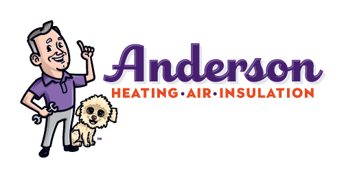
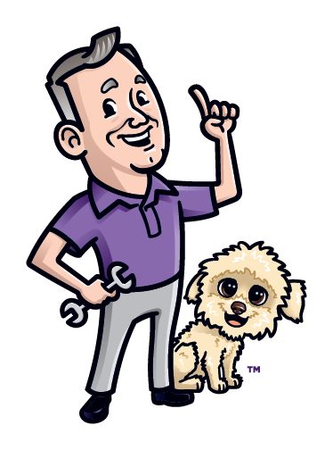

# Anderson HAI Logo Integration Plan

## Current Logo Usage on Website

### Files to Update:
1. **index.html** (line 129): Navigation header logo
2. **index.html** (line 12): Social media preview image
3. **All other pages**: Header navigation logos (200+ files)
4. **Footer**: Currently uses 🐾 emoji - can enhance with mascot

### Recommended Updates:

#### Navigation Header (48x48px)
```html
<!-- BEFORE: -->


<!-- AFTER: -->

```

#### Social Media Preview
```html
<!-- BEFORE: -->
<meta property="og:image" content="https://shylohchavez.github.io/anderson-hai/images/logo.png">

<!-- AFTER: -->  
<meta property="og:image" content="https://johnandersonservice.com/images/anderson-logo-full.png">
```

#### Footer Enhancement
```html
<!-- Current paw emoji can be replaced with actual Gypsy mascot -->
<div class="w-9 h-9 bg-white/20 rounded-full flex items-center justify-center text-lg">
    
</div>
```

## Benefits of Authentic Logo Integration:

### Brand Consistency:
- Real John & Gypsy instead of generic placeholders
- Professional cartoon style matches friendly, family business approach
- Purple brand colors already match website color scheme (#4A1C6B)

### SEO Benefits:
- Unique visual branding for local recognition
- Mascot creates memorable brand association
- "The Paws-itive Choice" slogan reinforced visually

### Marketing Impact:
- Customers can see the actual people (John) and mascot (Gypsy) they're working with
- Builds trust and personal connection
- Differentiates from generic HVAC contractor imagery

## File Requirements:
- **anderson-logo-full.png**: Complete logo with text (1024x512px recommended)
- **anderson-mascot.png**: John & Gypsy only (512x512px recommended)  
- **anderson-favicon.png**: Square version for browser tabs (64x64px)

## Implementation Priority:
1. **HIGH**: Navigation headers across all pages
2. **HIGH**: Social media meta tags
3. **MEDIUM**: Footer mascot integration
4. **LOW**: Additional branding opportunities throughout content